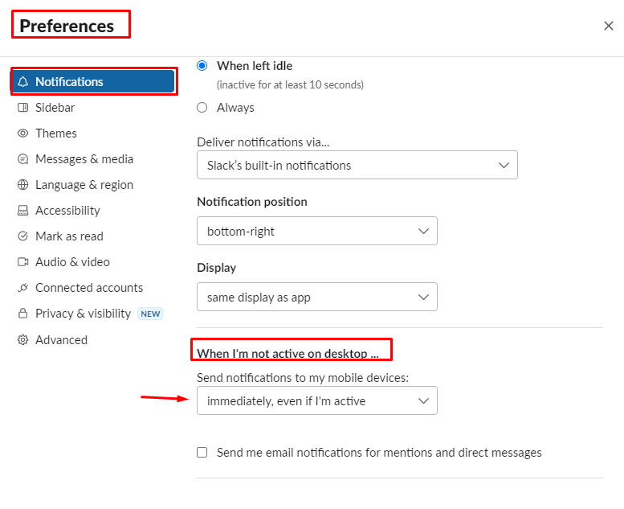
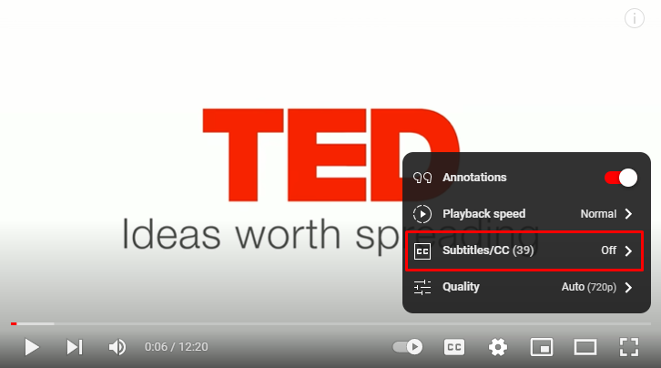
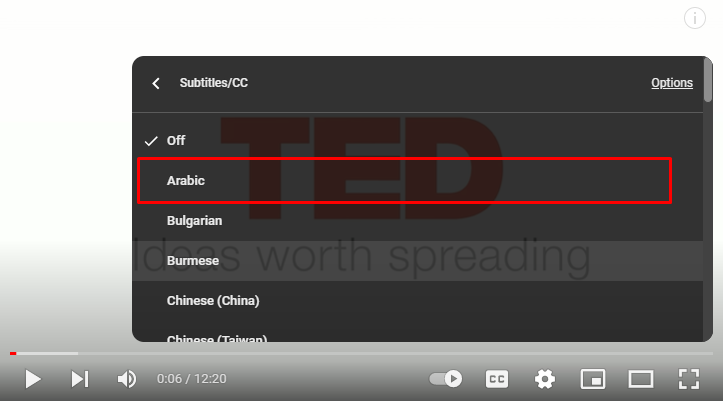
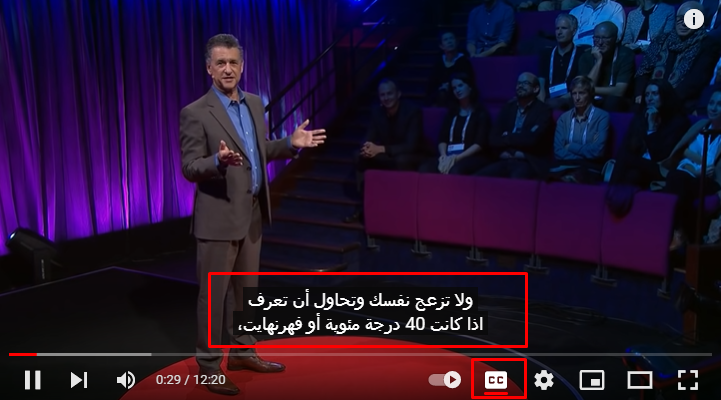

# How To Do Important Steps

## How To Customize Slack

- Change your Display Name to be: **depending on the student sheet (`display Name`)**
  Ex: **A1_Rama || B2_Ali**
- Add your picture to your slack account
  unique picture: any unique picture to recognize you. Ex: grass, pc, cat
- Go to Preferences - Notification - When I'm not active on desktop - When I'm not active on desktop => make it: Immediately, even if I’m active

  

## How to add subtitles to youtube videos:

1. Click on the subtitle icon - Subtitles/CC

   

2. Select the language you want to translate to (Arabic)

   

3. Now you should see the subtitle on the video

   

### Back to [**General_Stage**](../README.md#weeks)
